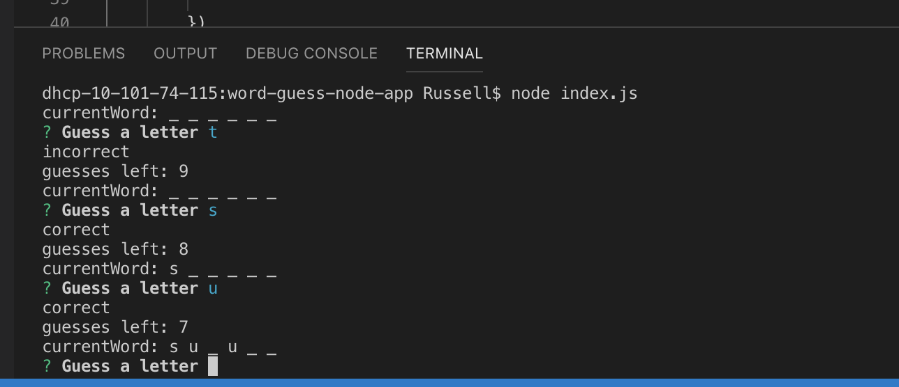
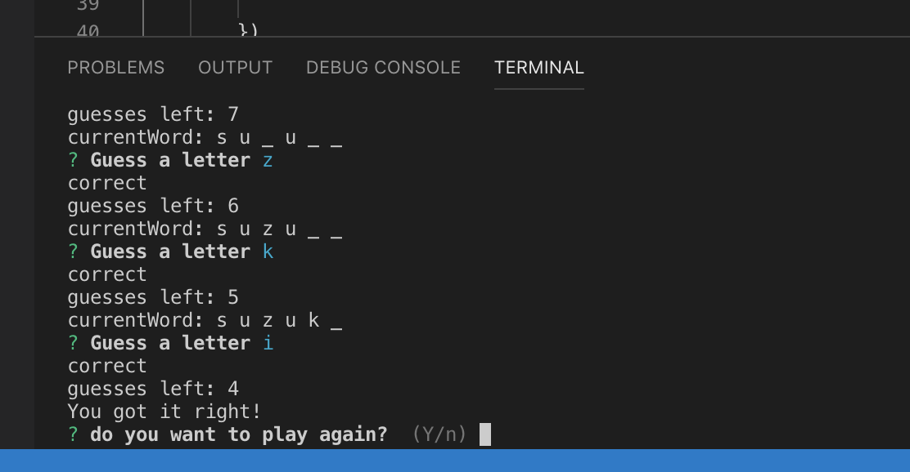

# Word Guess Node App
Word Guessing Game using NodeJs

* Display a mystery word represented by underscores
* The user inputs a letter guess
* the program checks if the letter is present in the mystery word
* The guesses are tracked and limited
* If the user gets all the letters in the word the user wins
* If the user uses all of their guesses before they solve the puzzle they lose

:earth_americas:

:water_buffalo:

### Game Play

### Game Completed

